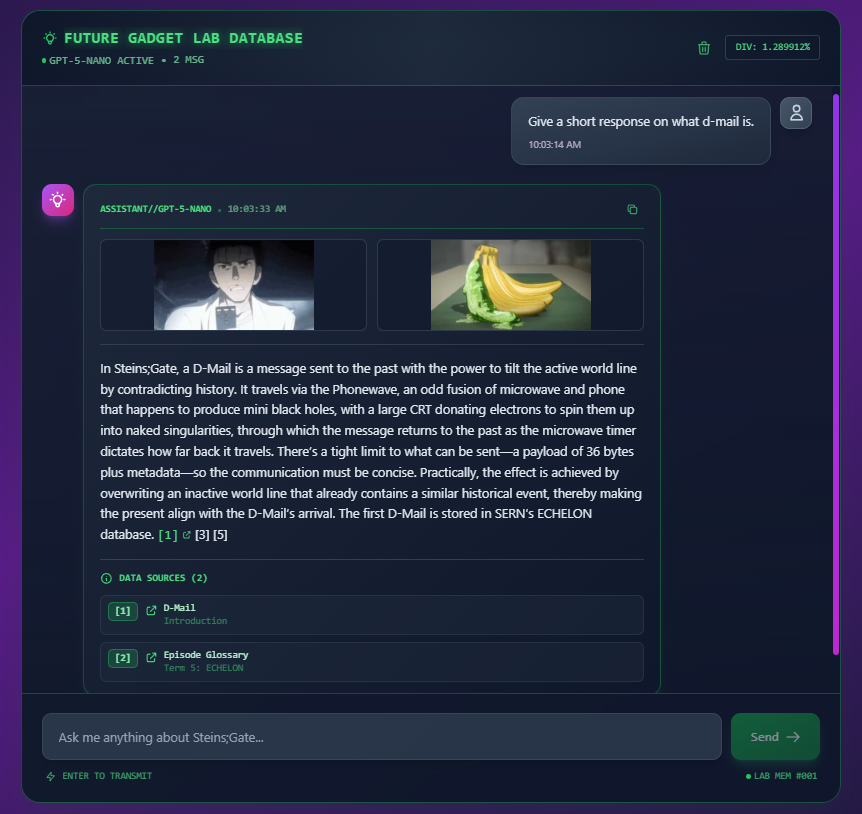

# Steins;Gate RAG Chatbot

<p align="center">
  
</p>

A full-stack RAG (Retrieval Augmented Generation) chatbot application focused on answering questions about the Steins;Gate anime. Built with React, Express, Langchain, and OpenAI.

## Screenshots

### Main Chat Interface


_Steins;Gate themed chat interface with CRT terminal aesthetics and animated divergence meter_

### Chat Response with Sources


_RAG-powered responses with source citations and wiki images_

## Features

- **RAG-powered responses**: Uses semantic search to find relevant information from the Steins;Gate wiki
- **Source citations**: Every response includes links to source wiki pages
- **Modern UI**: Beautiful dark-themed chat interface with Tailwind CSS
- **Streaming support**: Ready for streaming responses (implementation included)
- **Vector search**: Uses ChromaDB for efficient semantic search

## Tech Stack

### Frontend

- React 18 with Vite
- Tailwind CSS for styling
- Axios for API calls
- React Markdown for formatted responses

### Backend

- Express.js server
- Langchain for RAG orchestration
- OpenAI API for embeddings and chat
- ChromaDB as vector database
- Cheerio for web scraping

## Prerequisites

Before you begin, ensure you have the following installed:

- **Node.js** (v18 or higher)
- **npm** (comes with Node.js)
- **OpenAI API key** (get one at https://platform.openai.com/)
- **ChromaDB** (one of the following):
  - Docker (recommended): `docker pull chromadb/chroma`
  - Python: `pip install chromadb`

## Installation

### 1. Clone and Install Dependencies

```bash
cd C:\Users\sinan\OneDrive\Documents\javascriptprojects\wiki

# Install root dependencies
npm install

# Install all workspace dependencies
npm run install:all
```

### 2. Set Up Environment Variables

#### Server Environment

Create `server/.env` file:

```env
PORT=3001
NODE_ENV=development

# OpenAI API Key (REQUIRED)
OPENAI_API_KEY=sk-your-openai-api-key-here

# ChromaDB Configuration
CHROMA_URL=http://localhost:8000
CHROMA_COLLECTION=steinsgate_wiki

# CORS
CLIENT_URL=http://localhost:5173

# Logging
LOG_LEVEL=info
```

#### Client Environment

Create `client/.env` file:

```env
VITE_API_URL=http://localhost:3001/api
```

### 3. Start ChromaDB

Choose one of the following methods:

**Option 1: Docker (Recommended)**

```bash
docker run -p 8000:8000 chromadb/chroma
```

**Option 2: Python**

```bash
chroma run --host localhost --port 8000
```

Leave this running in a separate terminal.

## Data Preparation

Before running the application, you need to scrape the Steins;Gate wiki and create the vector database.

### Step 1: Scrape Wiki Content

```bash
cd server
npm run scrape
```

This will:

- Scrape the Steins;Gate Fandom wiki
- Extract content from Characters, Terminology, and Episodes categories
- Save raw data to `data/raw/`
- Expected output: ~200-300 wiki pages

**Note**: This process respects rate limits (1 second delay between requests) and may take 5-10 minutes.

### Step 2: Process Documents

```bash
npm run process
```

This will:

- Parse HTML and extract clean text
- Split content into semantic chunks
- Preserve metadata (source URLs, titles, sections)
- Save processed chunks to `data/processed/chunks.json`
- Expected output: ~2000-3000 chunks

### Step 3: Embed and Store

```bash
npm run embed
```

This will:

- Generate embeddings using OpenAI's `text-embedding-3-small`
- Store embeddings in ChromaDB
- Test the vector store with a sample query
- Expected time: 5-15 minutes depending on chunk count

**All-in-one command:**

```bash
npm run setup
```

This runs all three steps sequentially.

## Running the Application

Once data preparation is complete, you can start the application.

### Development Mode

**Option 1: Run both frontend and backend together (Recommended)**

```bash
# From root directory
npm run dev
```

**Option 2: Run separately**

Terminal 1 - Backend:

```bash
npm run dev:server
```

Terminal 2 - Frontend:

```bash
npm run dev:client
```

### Access the Application

- **Frontend**: http://localhost:5173
- **Backend API**: http://localhost:3001/api
- **Health Check**: http://localhost:3001/api/health

## Project Structure

```
wiki/
├── client/                 # React frontend
│   ├── src/
│   │   ├── components/    # React components
│   │   ├── hooks/         # Custom hooks
│   │   ├── services/      # API services
│   │   ├── App.jsx        # Main app
│   │   └── main.jsx       # Entry point
│   ├── index.html
│   └── package.json
│
├── server/                # Express backend
│   ├── src/
│   │   ├── config/       # Configuration
│   │   ├── controllers/  # Route controllers
│   │   ├── middleware/   # Express middleware
│   │   ├── routes/       # API routes
│   │   ├── services/     # Business logic
│   │   └── index.js      # Server entry point
│   ├── scripts/          # Data preparation scripts
│   │   ├── scrapeWiki.js
│   │   ├── processDocuments.js
│   │   └── embedDocuments.js
│   └── package.json
│
├── data/                 # Data storage (gitignored)
│   ├── raw/             # Scraped HTML
│   ├── processed/       # Processed chunks
│   └── vectorstore/     # ChromaDB data
│
└── package.json         # Root workspace config
```

## API Endpoints

### POST /api/chat

Send a message and get a RAG-powered response.

**Request:**

```json
{
  "message": "What is Reading Steiner?"
}
```

**Response:**

```json
{
  "id": "1234567890",
  "answer": "Reading Steiner is the name Rintaro Okabe gives to his ability...",
  "sources": [
    {
      "title": "Reading Steiner",
      "url": "https://steins-gate.fandom.com/wiki/Reading_Steiner",
      "section": "Overview",
      "relevance": 0.89
    }
  ],
  "timestamp": "2025-12-29T..."
}
```

### GET /api/health

Check server and service health.

**Response:**

```json
{
  "status": "ok",
  "timestamp": "2025-12-29T...",
  "services": {
    "server": "running",
    "vectorStore": "connected",
    "openai": "available"
  },
  "collection": "steinsgate_wiki"
}
```

## Usage Examples

Try asking questions like:

- "What is Reading Steiner?"
- "Who is Rintaro Okabe?"
- "Explain the concept of world lines"
- "What is a D-Mail?"
- "Tell me about Kurisu Makise"
- "What is the Organization?"
- "Explain the divergence meter"

## Troubleshooting

### ChromaDB Connection Failed

**Error:** `Vector store initialization failed`

**Solution:**

1. Ensure ChromaDB is running: `docker run -p 8000:8000 chromadb/chroma`
2. Check the CHROMA_URL in `.env` matches your ChromaDB instance
3. Verify you've run the data preparation scripts

### Collection Not Found

**Error:** `Collection 'steinsgate_wiki' not found`

**Solution:**
Run the data preparation scripts:

```bash
cd server
npm run scrape
npm run process
npm run embed
```

### OpenAI API Key Error

**Error:** `OPENAI_API_KEY environment variable is not set`

**Solution:**

1. Create `server/.env` file
2. Add your OpenAI API key: `OPENAI_API_KEY=sk-...`
3. Get a key at https://platform.openai.com/

### Frontend Can't Connect to Backend

**Error:** Network error or CORS error

**Solution:**

1. Ensure backend is running on port 3001
2. Check `client/.env` has `VITE_API_URL=http://localhost:3001/api`
3. Verify CORS settings in `server/src/config/config.js`

### Slow Responses

**Issue:** RAG responses take too long

**Solutions:**

1. Reduce number of retrieved chunks (edit `k` parameter in `rag.service.js`)
2. Use a faster OpenAI model (change to `gpt-3.5-turbo` in config)
3. Check your internet connection
4. Verify ChromaDB is running locally, not remotely

## Configuration

### Adjusting RAG Parameters

Edit `server/src/services/rag.service.js`:

```javascript
// Number of chunks to retrieve (default: 5)
const relevantDocs = await vectorStoreService.searchSimilar(query, 5);

// LLM temperature (0.0 = deterministic, 1.0 = creative)
temperature: 0.7;

// Change LLM model
modelName: "gpt-4-turbo-preview"; // or 'gpt-3.5-turbo'
```

### Adjusting Chunk Size

Edit `server/scripts/processDocuments.js`:

```javascript
const splitter = new RecursiveCharacterTextSplitter({
  chunkSize: 800, // Tokens per chunk
  chunkOverlap: 100, // Overlap between chunks
});
```

## Production Deployment

### Build Frontend

```bash
cd client
npm run build
```

The build output will be in `client/dist/`.

### Deploy Backend

1. Set environment variables on your hosting platform
2. Ensure ChromaDB is accessible (use ChromaDB Cloud or self-hosted)
3. Run: `cd server && npm start`

### Recommended Platforms

- **Frontend**: Vercel, Netlify
- **Backend**: Render, Railway, Heroku
- **ChromaDB**: ChromaDB Cloud, self-hosted on same platform as backend

## Cost Considerations

### OpenAI API Costs

**One-time (data preparation):**

- Embeddings: ~$0.50-$2.00 for 2000-3000 chunks
- Processing: One-time cost

**Per query:**

- Embedding query: ~$0.0001
- LLM response (GPT-4): ~$0.01-0.03 per query
- LLM response (GPT-3.5): ~$0.001-0.003 per query

**Cost optimization:**

- Embeddings are cached in ChromaDB (one-time cost)
- Use GPT-3.5-turbo for lower costs
- Implement response caching for common queries

## Development

### Adding New Categories

Edit `server/scripts/scrapeWiki.js`:

```javascript
const CATEGORIES = [
  { name: "Characters", url: "/wiki/Category:Characters" },
  { name: "Terminology", url: "/wiki/Category:Terminology" },
  { name: "Episodes", url: "/wiki/Category:Episodes" },
  { name: "YourCategory", url: "/wiki/Category:YourCategory" }, // Add here
];
```

Then re-run data preparation:

```bash
npm run scrape
npm run process
npm run embed
```

### Extending the UI

All React components are in `client/src/components/`. The app uses Tailwind CSS for styling.

Main components:

- `ChatInterface.jsx` - Main chat container
- `MessageBubble.jsx` - Individual messages
- `InputArea.jsx` - Message input
- `Header.jsx` - App header

## License

MIT

## Acknowledgments

- Steins;Gate Fandom Wiki for the content
- OpenAI for embeddings and LLM
- Langchain for RAG orchestration
- ChromaDB for vector storage

---

El Psy Kongroo!
